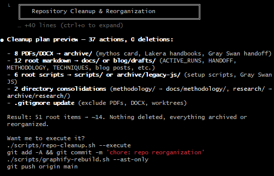
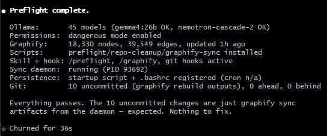
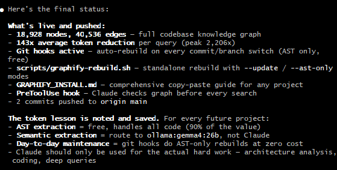

# claude_preflight

Per-project Claude Code optimization + agentic governance + agent rule-of-law. Knowledge graph mapping, continuous sync, safe reorg, OPA/Rego policy gates wired into a `PreToolUse` hook, adversarial audits, doctrine + memory promotion lifecycle, idea log for spontaneous user thoughts, LLM Council for high-stakes decisions.

Works on new projects and existing ones. Run it at the start of a project or drop it into one that's already active.

> **Agents**: if you were just handed this repo URL and asked to integrate it into a project, **read [`AGENT_HANDOFF.md`](AGENT_HANDOFF.md) end-to-end before doing anything else.** It tells you exactly what to do, in what order, and what bar you must hit before taking any action on the user's behalf.

## What it looks like

### Validation before restructuring

Preflight checks your environment, models, graph state, and sync daemon before proposing any changes.



### First run output

Full preflight pass showing Ollama connectivity, graphify installation, hook registration, and persistence setup.



### Token savings after graphify

After the knowledge graph is built, Claude navigates by structure instead of grepping raw files. Token savings scale with project size.



## Install

```bash
git clone git@github.com:JKSNS/claude_preflight.git /tmp/claude_preflight
cd your-project
/tmp/claude_preflight/install.sh
```

Installs the `/preflight` skill, graphify, scripts, safety hooks, plugin settings (autocompact, statusline, ccusage), and the persistence layer. After install, everything runs through Claude Code.

## Usage

Inside Claude Code:

```
/preflight              # all-in-one: read-only checks run automatically;
                        #   modifying steps prompt you per-step (default N)
/preflight --yes        # all-in-one without prompting (unattended bootstrap)
/preflight check        # read-only validation, no changes
/preflight install      # install scripts + graphify + persistence + cron
/preflight uninstall    # project-aware removal: cron + startup + .bashrc lines
/preflight sync         # start / status / restart the graphify sync daemon
/preflight cleanup      # staleness scan; --legacy-shuffle keeps the old name-based reorg
/preflight update       # pull latest from upstream (per-file diff before overwrite)
/preflight soft-refs    # generate overviews for large excluded dirs (with staleness check)
/preflight govern       # scaffold the agentic governance layer
/preflight model        # show / apply / check the model routing config
/preflight snapshot     # capture project state for one-line rollback
/preflight fresh        # purge + reinstall (uses snapshot first)

/govern                 # governance status (alias for /govern check)
/govern check           # audit governance state
/govern remember "<rule>"  # capture a durable instruction
/govern promote         # walk the promotion queue
/govern audit [<ref>]   # adversarial audit on a diff
/govern gate <input>    # query OPA gate
/govern test            # run policy tests
/govern onboard         # 20-question intake to fill canonical docs
/govern ingest          # seed candidates from prior-project memory
/govern synthesize      # distill the current session's themes into candidates
/govern context-pack    # aggregate doctrine + memory + status into one file agents read
/govern audit triage    # walk audits/findings/open.md interactively
```

Direct script invocations (no slash binding):

```bash
./scripts/idea-log.sh capture "<verbatim quote>"   # append to governance/idea_log.md
./scripts/idea-log.sh list                         # show captured ideas + status
./scripts/idea-log.sh status <id> <state>          # captured | considered | inbox-NNN | amendment-NNN | retired-noted
./scripts/idea-log.sh stale --days 30              # report ideas stuck in captured > N days

./scripts/council.sh decide "<question>"           # 3-stage / 11-call adversarial review
./scripts/council.sh decide "<q>" --leaning "<X>"  # only Contrarian opposes; other 4 stay balanced
./scripts/council.sh decide "<q>" --via ollama:qwen3.6:35b  # headless single-model mode
./scripts/council.sh continue 2 governance/councils/<TS>    # advance after agent-dispatched stage 1
./scripts/council.sh continue 3 governance/councils/<TS>    # advance after agent-dispatched stage 2

./scripts/project-ingest.sh                        # build .agent/project-ingest.md (required before drafting any doctrine)
./scripts/context-pack.sh                          # aggregate doctrine + memory + status into .agent/context-pack.md
./scripts/repair-hooks.sh --apply                  # clean orphan settings.json hook entries
./scripts/snapshot.sh create --trigger <reason>    # manual snapshot before destructive ops
./scripts/snapshot.sh restore <snapshot-id>        # interactive rollback
```

### Updating an existing install

```bash
./scripts/self-update.sh --check   # check for upstream updates
./scripts/self-update.sh           # pull latest & overwrite all scripts
```

Or from inside Claude Code:
```
/preflight update
```

Self-update clones the latest repo, then re-runs `install.sh --force` which overwrites all scripts, hooks, and skill definitions. Your `.graphifyignore`, graph data, and project-specific config are preserved.

## How it works

### Knowledge graph

Builds a persistent structural map of your codebase using [graphify](https://github.com/safishamsi/graphify). Claude reads the graph report before every search instead of grepping raw files.

Code files are parsed locally via tree-sitter AST — no API calls, no tokens, instant. Semantic extraction for docs and papers routes through local Ollama models instead of Claude subagents.

Token savings: 10-70x for small projects, 100-2000x for large ones.

### What you can do with it

Once the graph is built, Claude reads it before every search. This changes how you can interact with the codebase:

**Onboarding a new contributor:**
```
"How does classify route to specialists?"
"Walk me through the data flow from input to output."
"What are the main abstractions and how do they connect?"
```

**Refactoring analysis:**
```
"Which auto_* helpers duplicate logic?"
"Find all modules that implement retry/backoff patterns."
"What would a consolidated helper look like for these 4 files?"
```

**Impact analysis before touching a god node:**
```
"What breaks if I change ModelConfig?"
"Show everything that depends on KrakenState."
"If I rename ExploitManager, what files need updating?"
```

**Architecture review:**
```
"Why does KrakenState bridge 5 different communities?"
"Are there circular dependencies between modules?"
"Which components are most coupled and should be decoupled?"
```

### The graph is alive

The graph is not a snapshot. It grows and shrinks with your project automatically through persistent scheduled tasks.

**Git hooks** fire on every commit and branch switch. They rebuild the AST layer instantly at zero cost. New files get nodes. Deleted files lose them.

**Cron job** runs every 5 minutes. It diffs files by timestamp, skips anything unchanged, and runs semantic extraction on new or modified docs via Ollama. Zero API cost.

**Container restart hook** resumes the sync daemon automatically when the container reboots. A startup script in `~/.claude/startup/` is sourced from `.bashrc` on every new shell.

All three layers persist independently. If one fails, the others continue. The graph stays current across sessions, branches, and container restarts.

### Soft references

Large directories excluded from full graphify indexing (datasets, benchmarks, generated results) can still be represented in the graph as lightweight overview nodes.

```
/preflight soft-refs                    # auto-detect large dirs
./scripts/soft-references.sh results    # specific directories
```

Generates `graphify-out/SOFT_REFERENCES.md` with file counts, structure, and descriptions extracted from READMEs. No LLM cost.

### Stale-file detection

`/preflight cleanup` runs `scripts/staleness-scan.sh`, which combines four signals to flag files that look unused:

1. **Orphan in graphify graph** — node has zero inbound edges
2. **Not imported anywhere** — per-language pattern match (`import X`, `from X.Y`, `require('X')`, `<script src=X>`)
3. **Untouched in N days** — git log mtime threshold (default 180d)
4. **Filename heuristics** — `*.bak`, `*.old`, `*-v2.*`, `draft/`, `deprecated/`

A file gets flagged when it hits 2+ signals (configurable via `--signals N`). Lockfiles, manifests, and other "always keep" classes (`package-lock.json`, `Dockerfile`, `Makefile`, etc.) are excluded by default.

```
/preflight cleanup                              # report only → staleness-report.md
./scripts/staleness-scan.sh --apply             # interactive per-file move to archive/stale/ (auto-snapshots first)
./scripts/staleness-scan.sh --signals 1 --age 90  # more aggressive
```

Unlike the old name-based shuffler (removed in 0.7.1), this never moves files without explicit per-file approval, and a snapshot is always taken first.

### Model routing

Claude decides. Ollama executes.

| Task | Route | Cost |
|---|---|---|
| AST / code extraction | tree-sitter (local) | $0 |
| Doc / paper extraction | `qwen3.6:35b` via Ollama | $0 |
| Architecture decisions | Claude | tokens |
| Bug diagnosis | Claude | tokens |
| Novel code design | Claude | tokens |

The graphify skill checks `PREFLIGHT_EXTRACTION_MODEL` before dispatching subagents. If set to `ollama:<model>`, semantic extraction goes directly to Ollama — Claude orchestrates chunking and merging, Ollama grinds through the files. Falls back to Claude subagents only if Ollama is unreachable.

There is one model config (no offline/online toggle): Claude for reasoning and orchestration, Ollama `qwen3.6:35b` for graphify extraction.

```bash
./scripts/model-profile.sh           # show routing
./scripts/model-profile.sh apply     # write env vars into ~/.claude/settings.json
./scripts/model-profile.sh check     # verify Ollama has qwen3.6:35b pulled
```

Required Ollama models:
```bash
ollama pull qwen3.6:35b
```

### Safety hooks

Three hooks installed globally into `~/.claude/hooks/` with absolute paths — active in every project, not just the one that installed them:

| Hook | Trigger | What it does |
|---|---|---|
| `pre-bash-firewall.sh` | Before every Bash call | Blocks `rm -rf /`, `rm -rf ~`, `mkfs`, `dd if=...of=/dev/sd*`, `DROP DATABASE` |
| `protect-critical-files.sh` | Before Edit/Write | Blocks writes to `.env`, credentials, API keys, `.pem`, `.key` files |
| `post-edit-quality.sh` | After Edit/Write | Auto-formats with ruff (Python) and prettier (JS/TS) |

**CTF / security research**: bypass the firewall for a session:
```bash
export PREFLIGHT_UNSAFE=1
```

### Governance layer

A project-agnostic agentic governance layer. Three things working together so the human stops repeating themselves:

1. **Doctrine** — `governance/CONSTITUTION.md`, `GOVERNANCE.md`, `AGENTS.md`, `INTERACTION_STANDARDS.md`, `ANTI_PATTERNS.md`, `PROJECT_MEMORY_CONTRACT.md`. Plain-text, human-edited, authoritative.
2. **Memory lifecycle** — `memory/inbox.md` → `governance/PROMOTION_QUEUE.md` → canonical doc → `governance/policy-map.md`. Every durable instruction is captured, classified, promoted, and (when enforceable) bound to a check.
3. **Executable gates** — `policy/*.rego` modules with tests, the `scripts/agent-gate.sh` runtime wrapper, and `scripts/adversarial-audit.sh` for Codex / devil's-advocate / security-auditor / regression-hunter reviews.
4. **PreToolUse policy gate** — `hooks/pre-tool-policy-gate.sh` registered as a `*` matcher; every `Bash` / `Edit` / `Write` / `Read` / `WebFetch` is normalized into a JSON action and routed through OPA. `deny` exits 2 (Claude Code blocks the tool call); `require_approval` exits 2 unless `.agent/.gate-approve` exists (project-local, one-shot, deleted on consumption). When OPA isn't installed, the gate degrades to advisory mode (warns, does not block) so unrelated repos aren't bricked.
5. **Idea log + LLM Council** — `governance/idea_log.md` for spontaneous ideas, and `scripts/council.sh decide` for high-stakes decisions (see sections below).

Install into a project:

```bash
/preflight govern                          # scaffold templates, policies, scripts
./scripts/governance-check.sh              # audit governance state
./scripts/memory-promote.sh capture "..."  # capture a durable instruction
opa test policy/                           # run policy tests
```

Authority model: constitution > golden rules > executable gates > agent judgment > stale memory. Agents may propose amendments; agents may not ratify them. The reviewer agent may not equal the author agent for any non-doc-class change (`policy/review.rego`).

The full layout, lifecycle, and OPA prerequisites live in `governance/README.md`.

#### The constitution starts non-empty and grows

Three pieces fold prior experience and live session signal into the project automatically so the human stops repeating themselves:

- **Cross-project ingest** (`/govern ingest`) — walks `~/.claude/projects/*/memory/` for every other project the user has touched, finds durable items the user has already proven recurring, and seeds them as candidates here. New projects start with a non-empty queue. Idempotent via `Source-hash`.

- **Continuous synthesis** (`/govern synthesize` + `pre-compact-synthesize.sh`) — registers as a Claude Code `PreCompact` hook so the session's recurring themes (security focus, methodology preferences, frustrations, conventions used but never written) are distilled into candidates *before* the conversation context is lost. Uses Ollama, no API cost. Disable with `SESSION_SYNTHESIS_DISABLE=1`.

- **20-question intake** (`/govern onboard`) — interactive walk through the question bank in `governance/onboarding/questions.md`, or autonomous mode where the agent infers from the repo + cross-project memory and asks only the open questions. Output fills `CONSTITUTION.md`, `AGENTS.md`, `INTERACTION_STANDARDS.md`, `ANTI_PATTERNS.md`, `.agent/project-tier.yaml`, and starter rows in `policy-map.md`.

Together: install the layer, ratify what already-proven rules apply, answer the open questions once, and the constitution grows continuously from there.

### Idea log

A living, append-only, profanity-stripped log of the user's spontaneous thoughts. When the user says "I've been thinking", "what if", "wouldn't it be cool", "imagine if", "I noticed", "I had a thought", "we should" — capture the verbatim quote in the same response, before continuing whatever else you were doing. The idea log is for raw thought. `memory/inbox.md` is for durable instructions. `PROMOTION_QUEUE.md` is for classified candidates. They are different sinks.

```bash
./scripts/idea-log.sh capture "<verbatim quote>" \
    --title "<one-line title>" \
    --context "<situation that prompted it>" \
    --synthesis "<what this becomes if promoted>"
./scripts/idea-log.sh list
./scripts/idea-log.sh status <id> considered
./scripts/idea-log.sh stale --days 30
```

Status lifecycle: `captured → considered → inbox-NNN → amendment-NNN → retired-noted`. Format: `## YYYY-MM-DD` day header → `### HH:MM ZONE — title` entry → bold Quote / Context / Status / Synthesis labels → `---` separator. Profanity is regex-stripped (`fuck`/`shit`/etc → `[edited]`) so the log is shareable.

### LLM Council

For high-stakes decisions and brainstorming. NOT for every dev iteration — `scripts/adversarial-audit.sh` (Codex + devil's advocate + security + regression) handles iterative code review.

Three stages, eleven calls:

1. Five cognitive lenses respond to the same question in parallel: **Contrarian** (assume the proposal has a fatal flaw and find it), **First Principles** (strip back to the actual root requirement), **Expansionist** (what's the bigger play this could be a step toward), **Outsider** (someone outside the project's worldview reads it cold), **Executor** (what does shipping this actually cost in attention and surface area).
2. Five reviewers see the five responses anonymized as A-E (randomized mapping) and answer: strongest / biggest blind spot / what did all five miss.
3. Chairman synthesizes everything into Where-Council-Agrees / Where-It-Clashes / Blind-Spots / Recommendation / One-Thing-First, plus a `LOG TO:` routing line (idea_log / promotion_queue / amendment / task / nothing).

Two run modes:

```bash
# Default — uses the intelligence the user is already paying for.
# Script stages all 11 prompts to disk and exits with per-stage instructions.
# The running agent (Claude / Codex / whatever you're using) dispatches each
# prompt via its own Agent / subagent mechanism, writes responses back to the
# staged paths, then re-invokes the script for the next stage. Anonymization
# is real (separate subagents) instead of theatrical (same context).
./scripts/council.sh decide "<question>" --via agent

# Headless — for cron / CI / scripted use. Single-model council; chairman
# synthesis tags this as a confidence limitation in its output.
./scripts/council.sh decide "<question>" --via ollama:qwen3.6:35b

# Optional — lets the Contrarian take the explicit anti-position to a stated
# user leaning. The other four lenses stay balanced.
./scripts/council.sh decide "<q>" --leaning "I want to <X>"
```

The script refuses validation-seeking framings ("am I right that…", "validate that…", "confirm that…") because the council finds blind spots, not agreement. Invoke from the trigger phrases "council this", "war room this", "pressure-test this", "help me decide" — and only for genuine multi-option decisions with stakes. The bundle's `governance-check.sh` warns when council usage exceeds 3 runs in 7 days; if you're hitting that ceiling, you're using it as procrastination. Output goes to `governance/councils/<TS>/` with full audit trail (prompts, lens responses, peer reviews, chairman synthesis, anonymization map).

### Plugins

Install configures three plugins in `~/.claude/settings.json`:

**autoCompact** — automatically compact the context window when it fills up, keeping long sessions running without manual intervention.

**statusLine** — live status bar at the bottom of every Claude Code session:
```
claude@host:/path/to/project
claude-sonnet-4-6 | ctx: 23% | $0.0142
```

**ccusage** — CLI tool for tracking equivalent API cost across sessions:
```bash
npx ccusage              # cost summary for today
npx ccusage --live       # live usage dashboard
npx ccusage daily        # breakdown by day
```

## Persistence

All sync layers survive container restarts:

- Git hooks in `.git/hooks/`
- Cron job in crontab (every 5 min, skips if nothing changed)
- Startup script in `~/.claude/startup/` sourced from `.bashrc`
- Sync daemon started immediately on install if graph exists

```bash
crontab -l                          # view registered jobs
ls ~/.claude/startup/sync-*.sh      # view registered projects
```

Multiple Claude Code sessions can run against the same project. The sync daemon is the single writer. All sessions read the same graph snapshot. No coordination needed.

## Structure

```
claude_preflight/
├── install.sh              # bootstrap (one-time)
├── uninstall.sh            # clean removal
├── SKILL.md                # /preflight slash command
├── GRAPHIFY.md             # graphify reference
├── VERSION
├── hooks/
│   ├── pre-bash-firewall.sh
│   ├── protect-critical-files.sh
│   ├── post-edit-quality.sh
│   └── pre-compact-synthesize.sh   # PreCompact: distill themes before context loss
├── profiles/
│   └── default.json        # single config: Claude + Ollama qwen3.6:35b for graphify
├── skills/
│   ├── graphify/
│   │   └── SKILL.md        # /graphify slash command (Ollama-aware)
│   └── govern/
│       └── SKILL.md        # /govern slash command (governance layer)
├── governance/
│   ├── README.md
│   ├── templates/          # docs scaffolded into target projects
│   │   ├── CONSTITUTION.md
│   │   ├── GOVERNANCE.md
│   │   ├── AGENTS.md
│   │   ├── INTERACTION_STANDARDS.md
│   │   ├── ANTI_PATTERNS.md
│   │   ├── PROJECT_MEMORY_CONTRACT.md
│   │   ├── PROMOTION_QUEUE.md
│   │   ├── policy-map.md
│   │   ├── idea_log.md          # spontaneous-thought capture log
│   │   ├── memory/{inbox,index}.md + active|promoted|stale|rejected/
│   │   ├── amendments/
│   │   ├── audits/playbooks/council/   # contrarian, first-principles, expansionist, outsider, executor, peer-review, chairman
│   │   └── .agent/{project-tier,review-gates,audit-agents}.yaml
│   ├── onboarding/
│   │   └── questions.md       # 20-question intake bank
│   └── policy/                # Rego policies + tests
│       ├── agent.rego         # top-level dispatcher
│       ├── shell.rego
│       ├── filesystem.rego
│       ├── network.rego
│       ├── secrets.rego
│       ├── dependencies.rego
│       ├── git.rego
│       ├── deployment.rego
│       ├── review.rego
│       └── tests/
├── images/
│   ├── precheck.png
│   ├── output.png
│   └── improvement.png
├── templates/
│   └── .graphifyignore
└── scripts/
    ├── preflight.sh             # environment validator
    ├── graphify-rebuild.sh      # manual graph rebuild
    ├── graphify-sync.sh         # continuous sync daemon
    ├── self-update.sh           # pull latest & reinstall
    ├── soft-references.sh       # large dir overview generator
    ├── model-profile.sh         # show / apply / check the model routing config
    ├── governance-init.sh       # scaffold the governance layer
    ├── governance-check.sh      # audit governance state
    ├── memory-promote.sh        # capture and list memory candidates
    ├── agent-gate.sh            # query OPA on a normalized action
    ├── adversarial-audit.sh     # codex/devil's-advocate/security/regression review
    ├── cross-project-ingest.sh  # seed candidates from prior-project memory
    ├── session-synthesize.sh    # distill the running session into candidates
    ├── govern-onboard.sh        # 20-question intake (interactive | autonomous)
    ├── staleness-scan.sh        # graph-aware stale-file detection (cleanup default)
    ├── sync-health.sh           # sync daemon status + restart
    ├── snapshot.sh              # project state snapshot + interactive rollback
    ├── project-ingest.sh        # comprehensive project index (required before doctrine drafting)
    ├── context-pack.sh          # aggregate doctrine + memory + status into one file
    ├── repair-hooks.sh          # clean orphan settings.json hook entries
    ├── idea-log.sh              # capture / status / list / stale for governance/idea_log.md
    ├── council.sh               # 3-stage / 11-call LLM Council for high-stakes decisions
    ├── uninstall.sh             # project-aware removal (cron + startup + .bashrc)
    └── fresh.sh                 # full purge + reinstall (snapshots first)
```

Hooks:

```
hooks/
├── pre-bash-firewall.sh         # destructive-shell blocklist
├── protect-critical-files.sh    # secret-file protection
├── post-edit-quality.sh         # auto-format on Edit/Write
├── pre-compact-synthesize.sh    # PreCompact: distill themes before context loss
└── pre-tool-policy-gate.sh      # PreToolUse: every tool call → OPA decision
```

## Environment

| Variable | Default | Description |
|---|---|---|
| `OLLAMA_HOST` | `http://host.docker.internal:11434` | Ollama endpoint |
| `PREFLIGHT_EXTRACTION_MODEL` | unset (Claude subagents) | Set to `ollama:<model>` for local extraction |
| `GRAPHIFY_MODEL` | `qwen3.6:35b` | Model for semantic extraction |
| `GRAPHIFY_INTERVAL` | `300` | Seconds between sync cycles |
| `PREFLIGHT_UNSAFE` | unset | Set to `1` to bypass bash firewall |
| `PREFLIGHT_HOME` | bundle path (auto) | Where governance-init looks for the bundle |
| `SESSION_SYNTHESIS_MODEL` | `qwen3.6:35b` | Ollama model used by `session-synthesize.sh` |
| `SESSION_SYNTHESIS_DISABLE` | unset | Set to `1` to skip the PreCompact synthesis hook |
| `ADVERSARIAL_AUDIT_MODEL` | `qwen3.6:35b` | Ollama model used by non-Codex audit roles |
| `AGENT_GATE_POLICY` | auto (`policy/` then `governance/policy/`) | Policy directory queried by `agent-gate.sh` |
| `AGENT_GATE_QUERY` | `data.agent.decide` | OPA query expression |
| `AGENT_GATE_AUDIT_LOG` | `audits/gate.log` | Decision log; must resolve inside the project tree |
| `GOVERN_INBOX_STALE_DAYS` | `7` | Inbox-staleness threshold for `governance-check.sh` |
| `PREFLIGHT_GATE_DISABLE` | unset | Set to `1` to bypass the PreToolUse policy gate for the session |
| `PREFLIGHT_GATE_APPROVE` | unset | Fallback shell-global approval (warns; project-local `.agent/.gate-approve` is preferred) |

## Security

- Hooks use absolute paths — no project-relative path confusion
- No password piping to sudo — uses `sudo -n` (passwordless) or root check only
- Hook scripts are `755` — not world-writable
- Protected file list blocks writes to `.env`, credentials, keys, secrets
- Bash firewall blocks truly destructive commands (not normal git or file ops)
- No secrets stored in any config file

## Uninstall

```bash
/tmp/claude_preflight/uninstall.sh
```

## Related

- [claude_setup](https://github.com/JKSNS/claude_setup) - containerized Claude Code environment, safety hooks, base configuration
- [claude_plugins](https://github.com/JKSNS/claude_plugins) - autoresearch, project management, media generation, custom MCP servers

## License

CC BY-NC 4.0. Free to use and fork. Credit required. No commercial use.
